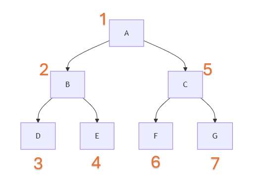
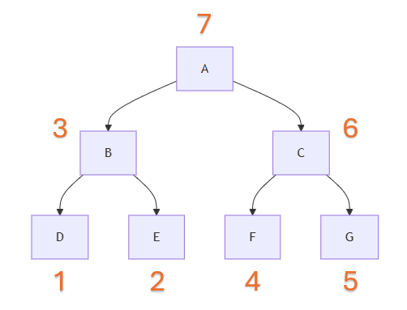
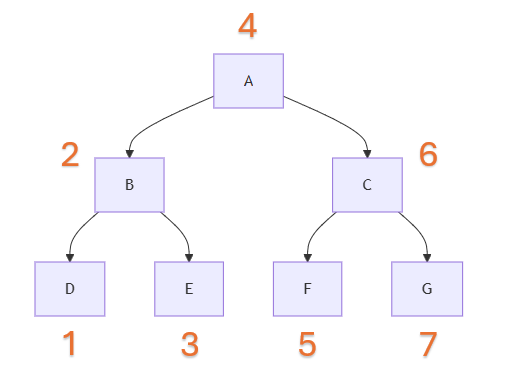

# Team Activity: Breadth First Search and Depth First Search on Trees

In this team activity you will explore using [Breadth First Search] and [Depth First Search] on a tree structure. 


## Code Walkthrough
In your group, review the code in [tree.h](tree.h) & [tree.c](tree.c). Explain to each other the various lines.
You should be able to answer the following questions:

* What is the purpose of the struct? - represents a node for adding to the tree of traversing
* What is the difference between addNode and addNodeBreadthFirst? - addNodeBreadthFirst() keeps track of the nodes with queue to traverse in the correct pattern
* Why would we need to remove `\n` in `read_file_into_tree`? - in the createNode() function, there are steps that rely on string data, if we don't remove the \n then the newlines will cause issues here, but we still need null chars to know where words end
* How are we adding nodes to a tree? Given the file [letters.txt](letters.txt), how does the tree look like? The tree looks like the mermaid chart below, top to bottom and left to right (breadth first)
  
Now, review the code in [printer.c](printer.c). Explain to each other the various lines.
You should be able to answer the following questions:

* Why would be need a queue for a breadth first search? (it may help to draw it out) - Because BFS goes level by level, it lends itself well to tracking with a queue which behaves in a FIFO pattern
* Would we need a queue for the Depth First Prints? Why or why not?
No, DFS is easy to express as recursive style function without any tracking


## Different Search Types
Looking at [letters.txt](letters.txt), we have A-G, in order. We can use this to create a tree structure,
and we will be focusing on a breadth first creation of the tree, by using the letters.txt file.

```mermaid
flowchart TD
    A --> B
    A --> C
    B --> D
    B --> E
    C --> F
    C --> G
```

### Breadth First Search
Breadth first search is a search algorithm that starts at the root node, and explores all of the neighbor nodes at the present depth prior to moving on to the nodes at the next depth level. Printing the letters in breadth first order would be: `A, B, C, D, E, F, G`. This is especially true as the order we added nodes was in a breadth first manner for this particular tree.


### Depth First Search: Preorder
Preorder is a depth first search, where the root is visited first, then the left subtree, then the right subtree.
Printing the letters in preorder would be: `A, B, D, E, C, F, G`. Take a moment to draw out the order
of the visits, and how this would look on the tree.



### Depth First Search: Postorder
Postorder is a depth first search, where the left subtree is visited first, then the right subtree, then the root.
Postorder would be: `D, E, B, F, G, C, A`. Take a moment to draw out the order based on the tree node traversal.



### Depth First Search: Inorder
Inorder is a depth first search, where the left subtree is visited first, then the root, then the right subtree.
Inorder would be: `D, B, E, A, F, C, G`. Take a moment to draw out the order based on the tree node traversal.



## 👉🏽 **Task** 👈🏽 - Write DFS Prints 

In [printer.c](printer.c), you will find a function `print_bfs` that prints the tree in a breadth first manner. Your task is to write the `print_dfs_preorder`, `print_dfs_postorder`, and `print_dfs_inorder` functions. These functions are much simpler than the `print_bfs` function. Also, they are recursive functions. It is recommended you get one of the functions working first, as the other two are very similar with only a change on where you put the print statement.

### Testing Print
To test your breadth first print, you can run the following commands:

```console
make 
./dfs_print.out letters.txt breadthfirst
```

To test the other print types, replace breadthfirst with preorder, postorder, or inorder. 


## 👉🏽 **Task** 👈🏽 - Use gnomes_names.txt
Using the names in [gnome_names.txt](gnome_names.txt)<sup>[2]</sup>, draw out the tree structure, each of the types of prints. Then run what you think the output would be against the output of your program. This file contains 10 names, so you would end up with an unbalanced tree.

```mermaid
flowchart TD
    Rielkick --> Tinbap
    Rielkick --> Gnirweet
    Tinbap --> Callbip
    Tinbap --> Cyddnum
    Gnirweet --> Wenzibist
    Gnirweet --> Luknekut
    Callbip --> Cisopnort
    Callbip --> Cienerbur
    Cyddnum --> Cononsbass
```

Breadth First Order (Level Order):
1. Rielkick
2. Tinbap
3. Gnirweet
4. Callbip
5. Cyddnum
6. Wenzibist
7. Luknekut
8. Cisopnort
9. Cienerbur
10. Cononsbass

Preorder (Root, Left, Right):
1. Rielkick
2. Tinbap
3. Callbip
4. Cisopnort
5. Cienerbur
6. Cyddnum
7. Cononsbass
8. Gnirweet
9. Wenzibist
10. Luknekut

Inorder (Left, Root, Right):
1. Cisopnort
2. Callbip
3. Cienerbur
4. Tinbap
5. Cononsbass
6. Cyddnum
7. Rielkick
8. Wenzibist
9. Gnirweet
10. Luknekut

Postorder (Left, Right, Root):
1. Cisopnort
2. Cienerbur
3. Callbip
4. Cononsbass
5. Cyddnum
6. Tinbap
7. Wenzibist
8. Luknekut
9. Gnirweet
10. Rielkick

## 👉🏽 **Task** 👈🏽 - Practicing With Larger Files
In programming, we often need to test our code with larger files. In this case, we have a file [elf_names.txt](elf_names.txt) that contains 40 names. While this file isn't as large as some of the files we deal with in the real world, it is large to make
calculating the DFS and BFS prints by hand difficult. 

We have provided three test files:
* elf_names_preorder.txt
* elf_names_postorder.txt
* elf_names_inorder.txt

The names are as they sound, the preorder, postorder, and inorder prints of the tree from elf_names.txt. In order to learn some of the tools we can use to test our code, we will be using the `diff` command. Run your code with the elf_names.txt file, with the following commands

```console
./dfs_print.out elf_names.txt preorder > my_preorder.txt
diff elf_names_preorder.txt my_preorder.txt
```

By default if the files are exactly the same, you will get no output. If there is a difference, you will get a line by line comparison of the two files. You can add a flag to tell it when the files are exactly the same, by adding the -s flag. 


```console
diff -s elf_names_preorder.txt my_preorder.txt
```

Try that with each of the ordering types. 

## Discussion  💬

In your group, discuss the following questions:

* What is the difference between a breadth first search and a depth first search? - BFS goes level by level, DFS uses recursion 
* What tasks are suited for a breadth first search? - Finding the shortest path in trees. Level-order traversal. Tasks where you need to process nodes closest to the root first.
* What tasks are suited for a depth first search? - searching quickly (doesn't check each level before moving on, ends when solution is found)
* Can you come up with everyday examples of inorder, postorder, and preorder? (hint, look at your calculator)

- Preorder: To-do list, doing each task before the subtasks
- Inorder: Reading a book, page by page 
- Postorder: Cleaning an area; sub-areas first, then main area last


Also for the tree:
* Define a Binary Search Tree. Write out the steps to add a node to a Binary Search Tree, and use a [gnomes_names.txt](gnomes_names.txt) file to draw out the tree that is a BST format.

A Binary Search Tree is a binary tree where each node has a value, and for every node:

- All values in the left subtree are less than the node’s value.
- All values in the right subtree are greater than the node’s value.

***
RAN OUT OF TIME AT THIS PART OF THE LAB
***

* How many steps is needed to get to `Canonsbass` as compared to just looking line by line in the file? 

* Discuss how you would implement a Binary Search Tree (BST) using the tree structure we have created.  
  * You may want to look at addNode() in [tree.c](tree.c) to see how that can be modified to add nodes to a BST.


* If you have time, modify the add node to add as one would in a BST node. `strcmp` can give you the high/low for each node.


## Conclusion
In this team activity, we have learned about the different types of search algorithms, and how they can be used to traverse a tree. We have also learned about the different types of tree traversals, and how they can be used to print out the tree in different orders.

We will come back to the traversal types when we explore graphs, which are a more complex data structure than trees but the fundamentals are the same. Searching is used throughout computer science, and knowing your data and which search is best
often helps with the efficiency of your program. For a Binary Search Tree (your homework), that is almost exclusively depth first traversal of your code, as you always know "which direction" to traverse until you find the node you are looking for.

## Technical Interview Practice

Take time practicing some of the past modules challenge problems. While you may not have time for everyone to do this, have a couple people practice "live coding". Live coding is a skill in interviews were you are asked to describe code **while** you are writing it. It can be a challenging skill, and it takes practice. I recommend that you setup a rotation of people to practice this skill within your team, ideally a couple every week. The other teams members can offer support, and then do a code review after a solution is generated. Then, as a group work a technical interview problem to discuss possible solutions.


## 📚 Resources
* [Ordering Differences of DFS]
* [BFS vs DFS Binary Tree]
* [Difference Between BFS and DFS]
* [DFS Traversal of a Tree Using Recursion]
* [Tree Traversal BFS and DFS]
* [Visual BST]
* [GDB Cheat Sheet]
* [GNU Make Manual]


---

[2]: Names were generated by Fantasy Name Generator: https://www.fantasynamegenerators.com/gnome-names.php

[Ordering Differences of DFS]: https://en.wikipedia.org/wiki/Depth-first_search#Output_of_a_depth-first_search
[Depth First Search]: https://en.wikipedia.org/wiki/Depth-first_search
[Breadth First Search]: https://en.wikipedia.org/wiki/Breadth-first_search
[GDB Cheat Sheet]: https://cs.brown.edu/courses/cs033/docs/guides/gdb.pdf
[Visual BST]: https://visualgo.net/en/bst
[BFS vs DFS Binary Tree]: https://www.geeksforgeeks.org/bfs-vs-dfs-binary-tree/
[Difference Between BFS and DFS]: https://www.geeksforgeeks.org/difference-between-bfs-and-dfs/ 
[DFS Traversal of a Tree Using Recursion]: https://www.geeksforgeeks.org/dfs-traversal-of-a-tree-using-recursion/
[Tree Traversal BFS and DFS]: https://www.codingeek.com/data-structure/tree-traversal-bfs-and-dfs-introduction-explanation-and-implementation/
[GNU Make Manual]: https://www.gnu.org/software/make/manual/make.html